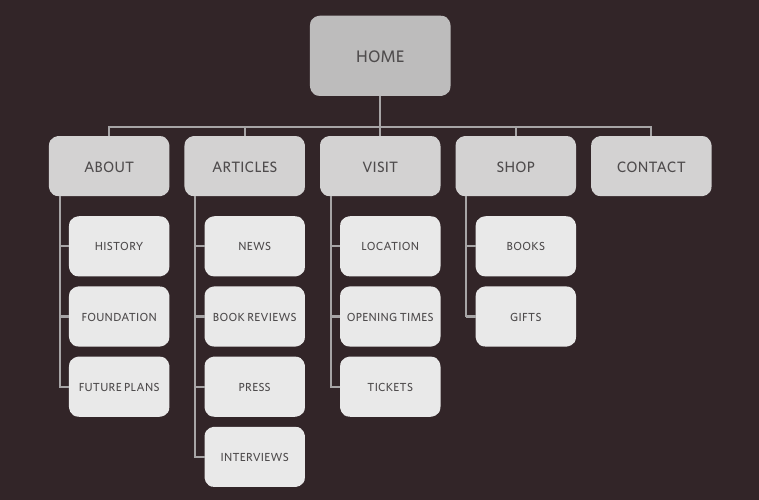
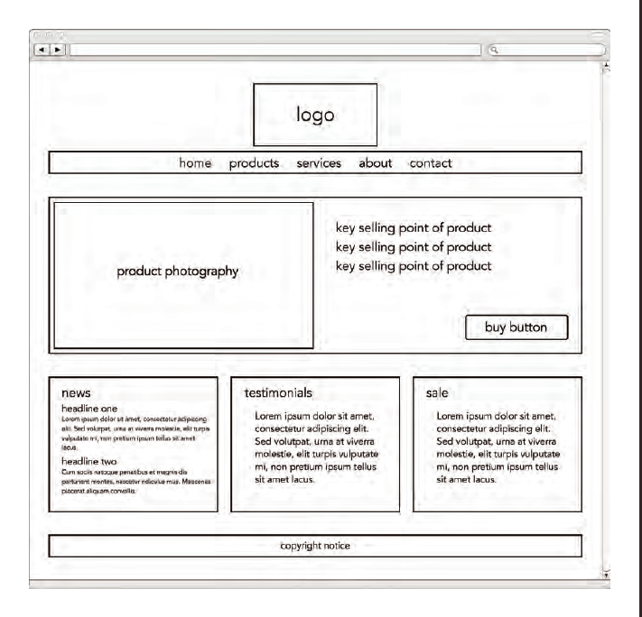
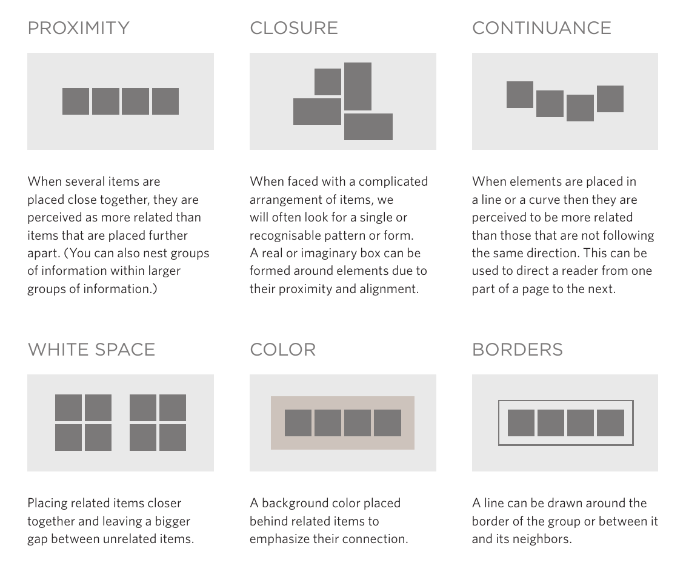

# 18. Process & Design

## Who is the Site For?

- Every website should be designed for the target audience - not just for yourself or the site owner. It is therefore very important to understand who your target audience is.

- It can be helpful to ask some questions about the people you would expect to be interested in the subject of your site.

- If you ask a client who a site is for, it is not uncommon for them to answer "the entire world."

- Realistically, it is unlikely to be relevant to everyone. If your site sells light bulbs, even though most people using a computer probably use light bulbs, they are not likely to order them from someone in a different country.

- Even if the site has a wide appeal, you can still think about the demographics of a sample of the target audience.
### Target Audience: individuals

- What is the age range of your target audience?
- Will your site appeal to more women or men? What is the mix?
- Which country do your visitors live in?
- Do they live in urban or rural areas?
- What is the average income of visitors?
- What level of education do they have?
- What is their marital or family status?
- What is their occupation?
- How many hours do they work per week?
- How often do they use the web?
- What kind of device do they use to access the web?
### Target Audience: Companies

- What is the size of the company or relevant department?
- What is the position of people in the company who visit your site?
- Will visitors be using the site for themselves or for someone else?
- How large is the budget they control?

- Invent some fictional visitors from your typical target audience. They can influence design decisions from color palettes to level of detail in descriptions.

- If you have a question about how the site is going to be used, or what its priorities should be, you will be able to think back and ask yourself, "What would your fictional visitor want in this situation?"
## Why People Visit YOUR Website

- Now that you know who your visitors are, you need to consider why they are coming. While some people will simply chance across your website, most will visit for a specific reason.

- Your content and design should be influenced by the goals of your users.
- To help determine why people are coming to your website, there are two basic categories of questions you can ask:
1. The first attempts to discover the underlying motivations for why visitors come to the site.
2. The second examines the specific goals of the visitors.
- These are the triggers making them come to the site now.
### Key Motivations

- Are they looking for general entertainment or do they need to achieve a specific goal?
- If there is a specific goal, is it a personal or professional one?
- Do they see spending time on this activity as essential or a luxury?
### Specific Goals

- Do they want general information/research (such as background on a topic/company), or are they after something specific (such as a particular fact or information on a product)?
- Are they already familiar with the service or product that you offer or do they need to be introduced to it?
- Are they looking for time sensitive information, such as the latest news or updates on a particular topic?
- Do they want to discover information about a specific product or service to help them decide whether to buy it or not?
- Do they need to contact you? If so, can they visit in person (which might require opening hours and a map)? Or might they need email or telephone contact details?
## What Your Visitors are Trying to Achieve

- It is unlikely that you will be able to list every reason why someone visits your site but you are looking for key tasks and motivations. This information can help guide your site designs.
## What Information Your Visitors Need

- You know who is coming to your site and why they are coming, so now you need to work out what information they need in order to achieve their goals quickly and effectively.

- You may want to offer additional supporting information that you think they might find helpful.
- Look at each of the reasons why people will be visiting your site and determine what they need to achieve their goals.
- You can prioritize levels of information from key points down to non-essential or background information.
- By ensuring that you provide the information that your visitors are looking for, they will consider your site more relevant to them.
- Therefore, you will have more opportunity to tell them any extra information that you think would be helpful to them (or to expose them to other products and services you want to promote).
- If you do not appear relevant to them by answering their needs, however, they are likely to go elsewhere.
- Here are some questions to help you decide what information to provide for visitors to your site...
### Key Information

- Will visitors be familiar with your subject area/brand or do you need to introduce yourself?
- Will they be familiar with the product/service/information you are covering or do they need background information on it?
- What are the most important features of what you are offering?
- What is special about what you offer that differentiates you from other sites that offer something similar?
- Once people have achieved the goal that sent them to your site, are there common questions people ask about this subject area?
## How Often People Will Visit Your Site

- Some sites benefit from being updated more frequently, while other content remains relatively static.
- A website about fashion trends will need to change a lot more frequently than one that is promoting a service that people do not buy regularly.
- Once a site has been built, it can take a lot of time and resources to update it frequently.
- Working out how often people are likely to revisit your site gives you an indication for how often you should update the site.

- It can often be helpful to set a schedule for when a site will be updated (rather than doing it on an ad hoc basis).
- You will often find that some parts of a site will benefit from being updated more frequently than others.

- Here are some questions to help you decide how often to update your website content...
### Goods / Services

- How often do the same people return to purchase from you?
- How often is your stock updated or your service changed?
### Information

- How often is the subject updated?
- What percentage of your visitors would return for regular updates on the subject, compared with those who will just need the information once?
## Site Maps

- Now that you know what needs to appear on your site, you can start to organize the information into sections or pages.

- The aim is to create a diagram of the pages that will be used to structure the site.
- This is known as a ***site map*** and it will show how those pages can be grouped.

- To help you decide what information should go on each page, you can use a technique called ***card sorting.***

- This involves placing each piece of information that a visitor might need to know on a separate piece of paper and then organizing the related information into groups.

- Each group relates to a page and, on larger sites the, pages can in turn can be grouped together to create different sections of the website.
- The groups of information are then turned into the diagram that is known as the ***site map***.
- Sometimes it can be helpful to ask people who are the target audience to help you group related information together.
- A site map will usually begin with the homepage.
- Additionally, if the site is large and is compartmentalized into sections, each section might require its own section homepage to link to all of the information within it.

- You may need to duplicate some information if it needs to appear on more than one page.
- The pages (or groups of pages) will inform how users navigate through the site.
- Remember to focus on the goals that your visitors want to achieve.
- It is worth noting that the site owner might organize information in a way that is different to what the public expects. It is important to reflect the public's understanding of the subject (rather than just the site owner's understanding of it).
## Example Site Map

## WireFrames

- A wireframe is a simple sketch of the key information that needs to go on each page of a site. It shows the hierarchy of the information and how much space it might require.

- A lot of designers will take the elements that need to appear on each page and start by creating wireframes. This involves sketching or shading areas where each element of the page will go (such as the logo, primary navigation, headings and main bodies of text, user logins etc).
- By creating a wireframe you can ensure that all of the information that needs to be on a page is included.
- You should not include the color scheme, font choices, backgrounds or images for the website in the wireframe. It should focus on what information needs to be on each page and create a visual hierarchy to indicate the most important parts of each page.
- The wireframes make design easier because you know what information needs to appear on which page before considering how the the page should look.

- You can sketch wireframes on paper or use a graphics application on your computer (such as Illustrator or InDesign).
- There are also online wireframe tools such as those at:
	- http://gomockingbird.com
	- http://lovelycharts.com

- It can be very helpful to show the wireframes of a site to a client before showing them a design. It enables the client to ensure the site has all the functions and information it needs to offer.
- If you just present a site design to a client, it is common for them to focus on how the site looks, which means they may not raise issues about its function after the site has been built.
## Example Wireframe

## Getting your message across using design

- The primary aim of any kind of visual design is to communicate. Organizing and prioritizing information on a page helps users understand its importance and what order to read it in.

### Content

- Web pages often have a lot of information to communicate.
- For example, the pages of online newspapers will have information that does not appear on every page of the print equivalent:
	- A masthead or logo
	- Links to navigate the site
	- Links to related content and other popular articles
	- Login or membership options
	- Ability for users to comment
	- Copyright information
	- Links to privacy policies, terms and conditions, advertising information, RSS feeds, subscription options
### Prioritizing

- If everything on a page appeared in the same style, it would be much harder to understand. (Key messages would not stand out.) 
- By making parts of the page look ***distinct*** from surrounding content, designers draw attention to (or away from) those items.
- Designers create something known as a ***visual hierarchy*** to help users focus on the key messages that will draw people's attention, and then guide them to subsequent messages.
### Organizing

- Grouping together related content into blocks or chunks makes the page look simpler (and easier to understand).
- Users should be able too identify the purpose of each block without processing each individual item.
- By presenting certain types of information in a similar visual style (such as using the same style for all buttons or all links), users will learn to associate that style with a particular type of content.

- With so much on the page, the designer needs to organize and prioritize the information to communicate their message and help users find what they're looking for.
## Visual hierarchy

- Most web users do not read entire pages. Rather, they skim to find information. You can use contrast to create a visual hierarchy that gets across your key message and helps users find what they are looking for.

### Size

- Larger elements will grab users' attention first. For this reason it is a good idea to make headings and key points relatively large.
### Color

- Foreground and background color can draw attention to key messages. Brighter sections tend to draw users' attention first.
### Style

- An element may be the same size and color as surrounding content but have a different style applied to it to make it stand out.

- Visual hierarchy refers to the order in which your eyes perceive what they see. It is created by adding visual contrast between the items being displayed. Items with higher contrast are recognized and processed first.
- Images create a high visual contrast and often attract the eye first. They can be used to draw attention to a specific message within the page. In some cases, the right image can succinctly reveal more than an entire page of text.

- The effect of a well-designed visual hierarchy is largely subliminal. Achieving a good hierarchy requires balance; if nothing stands out a site can be rather uninteresting, and if too many aspects are competing for your attention it can be hard to find the key messages. This example has a clear hierarchy which addresses the needs of visitors to the site.
## Grouping And Similarity

- When making sense of a design, we tend to organize visual elements into groups. Grouping related pieces of information together can make a design easier to comprehend. Here are some ways this can be achieved.

## Designing Navigation

- Site navigation not only helps people find where they want to go, but also helps them understand what your site is about and how it is organized.
- Good navigation tends to follow these principles...
### Concise

- Ideally, the navigation should be quick and easy to read. It is a good idea to try to limit the number of options in a menu to no more than eight links. These can link to section homepages which in turn link to other pages.
### Clear

- Users should be able to predict the kind of information that they will find on the page before clicking on the link.
- Where possible, choose single descriptive words for each link rather than phrases.
### Selective

- The primary navigation should only reflect the sections or content of the site. Functions like logins and search, and legal information like terms and conditions and so on are best placed elsewhere on the page.

- A large site may have primary, secondary and even tertiary navigation. Primary navigation often appears across the top of the site from left to right, or down the left hand side of the page. Secondary navigation could be under the primary navigation or down the side of the page. Tertiary navigation often sits in the footer of the page. The menu will not be the only way users navigate the site. They will also use links within each page. Some sites also offer a search function.
#### Online Extra

- Go to the website accompanying this book for information on how to implement search functionality for your site using Google Search.
### Context

- Good navigation provides context. It lets the user know where they are in the website at that moment. Using a different color or some kind of visual marker to indicate the current page is a good way to do this.
### Interactive

- Each link should be big enough to click on and the appearance of the link should change when the user hovers over each item or clicks on it. It should also be visually distinct from other content on the page.
### Consistent

- The more pages a site contains, the larger the number of navigation items there will be. Although secondary navigation will change from page to page, it is best to keep the primary navigation exactly the same.