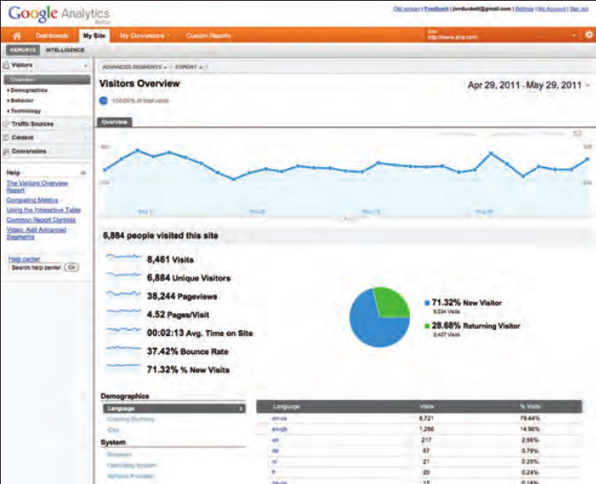

# 19. Practical Information

## Search Engine Optimization (SEO)

- SEO is a huge topic and several books have been written on the subject. The following pages will help you understand the key concepts so you can improve your website's visibility on search engines.
### The Basics

- Search engine optimization (or SEO) is the practice of trying to help your site appear nearer the top of search engine results when people look for the topics that your website covers.
- At the heart of SEO is the idea of working out which terms people are likely to enter into a search engine to find your site and then using these terms in the right places on your site to increase the chances that search engines will show a link to your site in their results.
- In order to determine who comes first in the search results, search engines do not only look at what appears on your site. They also consider how many sites link to you (and how relevant those links are). For this reason, SEO is often split into two areas: on-page techniques and off-page techniques.
### On-Page Techniques

- On-page techniques are the methods you can use on your web pages to improve their rating in search engines.
- The main component of this is looking at keywords that people are likely to enter into a search engine if they wanted to find your site, and then including these in the text and HTML code for your site in order to help the search engines know that your site covers these topics.
- Search engines rely very heavily on the text that is in your pages so it is important that the terms people are going to search for are in text. There are seven essential places where you want your keywords to appear.
- Ensuring that any images have appropriate text in the value of their `alt` attribute also helps search engines understand the content of images.
### Off-Page Techniques

- Getting other sites to link to you s just as important as on-page techniques. Search engines help determine how to rank your site by looking at the number of other sites that link to yours.
- They are particularly interested in sites whose content is related to yours. For example, if you were running a website that sold fish bait, then a link from a hairdresser is not likely to be considered as relevant as one from an angling community.
- Search engines also look at the words between the opening `<a>` tag and closing `</a>` tag in the link. If the text in the link contains keywords (rather than just click here or your website address) it may be considered more relevant.
- The words that appear in links to your site should also appear in the text of the page that the site links to.
## On-Page SEO

- In every page of your website there are seven key places where keywords can appear in order to improve its findability.

### 1. Page Title

- The page title appears at the top of the browser window or on the tab of a browser. It is specified in the `<title>` element which lives inside the `<head>` element.
### 2. URL/Web Address

- The name of the file is part of the URL. Where possible, use keywords in the file name.
### 3. Headings

- If the keywords are in a heading `<hn >` element then a search engine will know that this page is all about that subject and give it greater weight than other text.
### 4. Text

- Where possible, it helps to repeat the keywords in the main body of the text at least 2-3 times. Do not, however, over-use these terms, because the text must be easy for a human to read.
### 5. Link Text

- Use keywords in the text that create links between pages (rather than using generic expressions such as "click here").
### 6. Image Alt Text

- Search engines rely on you providing accurate descriptions of images in the `alt` text. This will also help your images show up in the results of image-based searches.
### 7. Page Descriptions

- The description also lives inside the `<head>` element and is specified using a `<meta>` tag. It should be a sentence that describes the content of the page. (These are not shown in the browser window but they may be displayed in the results pages of search engines.)

- Never try to fool search engines! They will penalize you for it. For example, never add text in the same color as the background of the page as they can detect this.
## How to Identify Keywords and Phrases

### 1. Brainstorm

- List down the words that someone might type into Google to find your site. Be sure to include the various topics, products or services your site is about.
- Your list may include some keyword phrases (not just individual words) if you have topics which are described by more than one word.
### 2. Organize

- Group the keywords into separate lists for the different sections or categories of your website.
### 3. Research

- There are several tools that let you enter your keywords and then they will suggest additional keywords you might like to consider, such as: 
	- adwords.google.co.uk/select/KeywordToolExternal (When using this tool, select the "exact match" option rather than "broad match.")
	- www.wordtracker.com
	- www.keyworddiscovery.com
- Once these tools have suggested additional keywords, add the relevant options to your lists.
- (Keyword tools will most likely suggest some terms that are irrelevant so do omit any that do not seem appropriate).
### 4. Compare

- It is very unlikely that your site will appear at the top of the search results for every keyword. This is especially true for topics where there is a lot of competition. The more sites out there that have already been optimized for a given keyword, the harder it will be for you to rise up the search results when people search on that term.
- Some of the keyword research sites can tell you how many people have searched for a specific keyword to help you know how much competition those terms have.
- You can also use Google's advanced search feature to just search the titles of web pages. This will help you to determine how many sites have that keyword in the title of their pages. (The more pages with the term in the title, the more competition there is.)
### 5. Refine

- Now you need to pick which keywords you will focus on. These should always be the ones that are most relevant to each section of your site.
- If there is a phrase that is very relevant but you find there is a lot of competition, you should still use it. To improve the chances of your site being found you can look at whether there are other words that could be incorporated into a phrase.
- For example, if the information or service you offer on your website is location specific, then you will often find that incorporating your location into your keyword list will help people find you.
### 6. Map

- Now that you have a refined list of keywords, you know which have the most competition, and which ones are most relevant, it is time to start picking which keywords you will use for each page.
- Pick 3-5 keywords or phrases that map to each page of your website and use these as the keywords for each page.
- You should not need to repeat the same keywords on all of the pages. It is also likely that, as you move further away from the homepage into the sections of the site, the keywords will become more specific to the individual topic dealt with on each page.
## Analytics: Learning about your Visitors

- As soon as people start coming to your site, you can start analyzing how they found it, what they were looking at and at what point they are leaving. One of the best tools for doing this is a free service offered by Google called ***[[Google Analytics]]***.
### Signing Up

- The Google Analytics service relies on you signing up for an account at: www.google.com/analytics
- The site will give you a piece of tracking code which you need to put on every page of your site.
### How It Works

- Every time someone loads a page of your site, the tracking code sends data to the Google servers where it is stored. Google then provides a web- based interface that allows you to see how visitors use your site.
### The Tracking Code

- A tracking code is provided by Google Analytics for each website you are tracking. It should appear just before the closing `</head>` tag. The code does not alter the appearance of your web pages.
## How Many People Are Coming to Your Site?

- The overview page gives you a snapshot of the key information you are likely to want to know. In particular, it tells you how many people are coming to your site.
### Visits

- This is the number of times people have come to your site. If someone is inactive on your site for 30 minutes and then looks at another page on your site, it will be counted as a new visit.
### Unique Visits

- This is the total number of people who have visited your site over the specified period. The number of unique visits will be lower than the number of visits if people have been returning to your site more than once in the defined period.
### Page Views

- The total number of pages all visitors have viewed on your site.
### Pages Per Visit

- The average number of pages each visitor has looked at on your site per visit.
### Average Time On Site

- The average amount of time each user has spent on the site per visit.
### Date Selector

- Using the date selector in the top right hand corner of the site, you can change the period of time the reports display. When you log in, this is usually set to the last month, but you can change it to report on a specific time period.
### Export

- The export link just above the title that says "visitors overview" allows you to export the statistics on this page for other applications such as Excel.

## What Are Your Visitors Looking At?

- The content link on the left-hand side allows you to learn more about what the visitors are looking at when they come to your site.
### Pages

- This tells you which pages your visitors are looking at the most and also which pages they are spending the most time on.
### Landing Pages

- These are the pages that people arrive on when first visiting your site. This can be particularly helpful because you may find people are not always coming into your site via the homepage.
### Top Exit Pages

- This shows which pages people most commonly leave from. If a lot of people are leaving from the same page then you might consider changing that page or improving it.
### Bounce Rate

- This shows the number of people who left on the same page that they arrived on. A high bounce rate suggests that the content is not what they were looking for or that the page did not sufficiently encourage them to look around the rest of the site. 
- What counts as a bounce:
	- Clicked a link to another site
	- Clicked on an advertisement
	- Entered a new URL
	- Used the "back" button
	- Closed the browser
## Where Are Your Visitors Coming From?

- The traffic sources link on the left hand side allows you to learn where your visitors are coming from.
### Referrers

- This shows the sites that have linked to you and the number of people who have come via those sites. If a site sends a lot of traffic to you, get in touch and try to work together to ensure that traffic keeps flowing. You could also try to find similar sites and ask them to link to you.
### Direct

- This shows which page a user arrived on if they did not come via a link on another site. They might have typed the URL into their browser, used a browser bookmark, or clicked a link in an email, PDF, or Word document.
### Search Terms

- This shows the terms users entered into a search engine to find your site. This can help you learn how visitors describe what they're looking for (which is often different to how someone might describe their own site). This can help you fine-tune your content and your SEO keywords.
### Advanced Features

- We have only scratched the surface of what you can find out about your visitors from Google Analytics. 
- Their help files tell you many more of the advanced features. If you run an online shop, it is well worth looking at their e-commerce tracking, which adds information about products sold, average basket size and much more.
- You can also set up goals where you specify the paths you want people to take, and then see how far they get through those paths, which is especially useful when gathering data from users.
## Domain Names & Hosting

- In order to put your site on the web you will need a domain name and web hosting.
### Domain Names

- Your domain name is your web address. There are many websites that allow you to register domain names. Usually you will have to pay an annual fee to keep that domain name.
- These sites usually have a form that allows you to check whether your preferred domain name is available, and because millions of domain names have already been registered, it might take you a while to find the one that is right for your site.
- A lot of sites that offer domain name registration also offer web hosting.
### Web Hosting

- So that other people can see your site, you will need to upload it to a web server. Web servers are special computers that are constantly connected to the Internet. They are specially set up to serve web pages when they are requested. 
- With the exception of some very large sites, most websites live on web servers run by web hosting companies. This is usually far cheaper and more reliable than trying to run your own web servers. 
- There are lots of different types of hosting on offer. We will now take a look at some of the key things that will help you choose which hosting company to use
#### Disk Space

- This refers to the total size of all of the files that make up your site (all of the HTML and CSS files, images and scripts).
#### Bandwidth

- This is the amount of data the hosting company will send to your site's visitors. If you imagine 10 people looked at every page on your site, then it would be the equivalent to 10 times the amount of disk space you use. 
#### Backups

- Check whether the hosting company performs backups on your site (and how often). Some only create backups so that they can restore your website in the event of a server breaking.
- Others allow access to backups (which can be helpful if you accidentally break the site when updating it).
#### Email Accounts

- Most hosting companies will provide email servers with their web hosting packages. You will want to check the size of mailbox you are allowed and the number of mailboxes you can use.
#### Server-Side Languages and Databases

- If you are using a content management system, it will likely use a server-side programming language and a database (such as PHP with a MySQL database, or ASP.Net with a SQL Server database). Be sure to check that your hosting company supports the technologies your software needs to run.

- It is often worth searching for reviews of a hosting company to see what other people's experience has been with a hosting company. Unfortunately, you often can only tell how good a hosting company is when something goes wrong, at which point you find out how they are able to help you (so you can expect to see a few negative reviews for any company).
### Hosted Services

- There are a number of online services that allow you to point your domain name to their servers. Blogging platforms such as `WordPress.com`, `Tumblr`, and `Posterous`, or e-commerce platforms such as ***Big Cartel*** and ***Shopify*** provide the servers that your site is hosted on. If you are using a platform like this you will not need your own hosting for the website, although you often still need hosting for your email. If this is the case, some web hosting companies offer packages that will just offer email services.
## FTP & Third Party Tools

- To transfer your code and images from your computer to your hosting company, you use something known as ***File Transfer Protocol***.
- As the name suggests, File Transfer Protocol (or FTP) allows you to transfer files across the Internet from your computer to the web server hosting your site.

- There are many FTP programs that offer a simple interface that shows you the files on your computer alongside the files that are on your web server. These allow you to drag and drop files from your computer to the server or vice versa.

- There are a wide variety of sites that offer services commonly created by web developers (to save you having to build them yourself).

- Some hosting companies offer tools to upload files to their servers using a web browser, but it is more common to use an FTP program as they are faster at transmitting files.
- ***Here is a list of some popular FTP applications:***
- ***FileZilla***: filezilla-project.org - Windows, Mac, Linux
- ***FireFTP***: fireftp.mozdev.org - Windows, Mac, Linux
- ***CuteFTP***: cuteftp.com - Windows, Mac
- ***SmartFTP***: smartftp.com - WIndows
- ***Transmit***: panic.com/transmit - Mac

- ***Here is a list of some popular third party tools:***
### Blogs

- wordpress.com
- tumblr.com
- posterous.com
### E-commerce

- shopify.com
- bigcartel.com
- go.magento.com
### Email newsletters

- campaignmonitor.com
- mailchimp.com
### Social networking sharing buttons
- addthis.com
- addtoany.com
