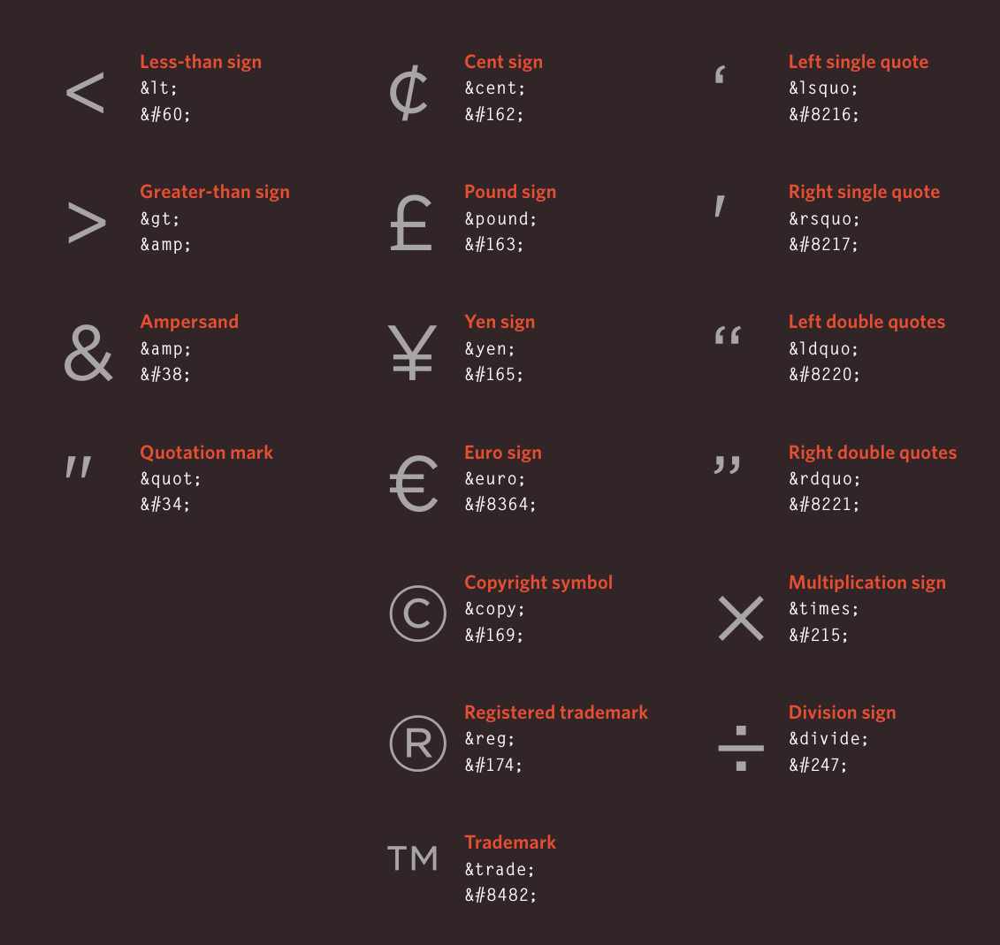

# 8. Extra Markup

## The Evolution of HTML

- Since the web was first created, there have been several different versions of HTML.

- Each new version was designed to be an improvement on the last (with new elements and attributes added and older code removed).
- There have also been several versions of each browser used to view web pages, each of which implements new code. Not all web users, however, have the latest browsers installed on their computers, which means that not everyone will be able to view all of the latest features and markup.

- Where you should be particularly aware of browsers not supporting certain features, I have made a note of this (as you have seen with some of the HTML5 elements introduced in the Forms chapter - and as you will see in the CSS chapters).
### HTML 4
***Released 1997***

- With the exception of a few elements added in HTML5 (which have been highlighted), the elements you have seen in this book were all available in HTML 4.

- Although HTML 4 had some presentational elements to control the appearance of pages, authors are not recommended to use them any more. (Examples include the `<center>` element for centering content on a page, `<font>` for controlling the appearance of text, and `<strike>` to put a line through the text - all of these can be achieved with CSS instead.)
### XHTML 1.0 
***Released 2000***

- In 1998, a language called XML was published. Its purpose was to allow people to write new markup languages. Since HTML was the most widely used markup language around, it was decided that HTML 4 should be reformulated to follow the rules of XML and it was renamed XHTML. This meant that authors had to follow some new, more strict rules about writing markup. For example:
	- Every element needed a closing tag (except for empty elements such as `` ).
	- Attribute names had to be in lowercase.
	- All attributes required a value, and all values were to be placed in double quotes.
	- Deprecated elements should no longer be used.
	- Every element that was opened inside another element should be closed inside that same element.

- The examples in this book all follow these strict rules of XML.
- One of the key benefits of this change was that XHTML works seamlessly with other programs that are written to create and process XML documents.
- It could also be used with other data formats such as ***Scalable Vector Graphics (SVG)*** - a graphical language written in XML, MathML (used to mark up mathematical formulae), and CML (used to mark up chemical formulae).

- In order to help web page authors move to this new syntax, two main flavors of XHTML 1.0 were created:
	- ***Strict XHTML 1.0***, where authors had to follow the rules to the letter
	- ***Transitional XHTML 1.0***, where authors could still use presentational elements (such as `<center>` and `<font>`).

- The transitional version of XHTML was created because it allowed authors to continue to follow older practices (with a less strict syntax) and use some of the elements and attributes that were going to be removed from future versions of HTML.
- There was also a third version of ***XHTML 1.0*** called ***XHTML 1.0 Frameset***, which allowed web page authors to partition a browser window into several "frames," each of which would hold a different HTML page.
- These days, frames are very rarely used and are being phased out.
### HTML5
***Released 2000***

- In HTML5, web page authors do not need to close all tags, and new elements and attributes will be introduced. At the time of writing, the HTML5 specification had not been completed, but the major browser makers had started to implement many of the new features, and web page authors were rapidly adopting the new markup.
- Despite the fact that HTML5 is not yet completed, you can safely take advantage of the new features of the language as long as you endeavour to ensure that users with older browsers will be able to view your pages (even though some of the extra features will not be visible to them).
## Doctypes

- Because there have been several versions of HTML, each web page should begin with a DOCTYPE declaration to tell a browser which version of HTML the page is using (although browsers usually display the page even if it is not included).
- We will therefore be including one in each example for the rest of the book.

- As you will see when we come to look at CSS and its box model on page 316, the use of a DOCTYPE can also help the browser to render a page correctly.
- Because XHTML was written in XML, you will sometimes see pages that use the XHTML strict DOCTYPE start with the optional XML declaration.
- Where this is used, it should be the first thing in a document.
- There must be nothing before it, not even a space.

- HTML5
```
<!DOCTYPE html>
```
- HTML 4
```<!DOCTYPE html PUBLIC
"-//W3C//DTD HTML 4.01 Transitional//EN"
"http://www.w3.org/TR/html4/loose.dtd">
```
- Transitional XHTML 1.0
```
```<!DOCTYPE html PUBLIC
"-//W3C//DTD XHTML 1.0 Transitional//EN"
"http://www.w3.org/TR/xhtml1/DTD/
xhtml1-transitional.dtd">
```
- Strict XHTML 1.0
```
<!DOCTYPE html PUBLIC
"-//W3C//DTD XHTML 1.0 Strict//EN"
"http://www.w3.org/TR/xhtml1/DTD/
xhtml1-strict.dtd">
```
XML Declaration
```
<?xml version="1.0" ?>
```
## Comments in HTML

`<!-- -->`
- If you want to add a comment to your code that will not be visible in the user's browser, you can add the text between these characters:
```html
<!-- comment goes here -->
```

- It is a good idea to add comments to your code because, no matter how familiar you are with the page at the time of writing it, when you come back to it later (or if someone else needs to look at the code), comments will make it much easier to understand.

- Although comments are not visible to users in the main browser window, they can be viewed by anyone who looks at the source code behind the page.

- On a long page you will often see comments used to indicate where sections of the page start or end, and to pass on notes to help anyone who is looking at the code understand it.
- Comments can also be used around blocks of code to stop that code from being displayed in the browser. In the example on the left, the email link has been commented out.
## ID Attribute

- Every HTML element can carry the `id` attribute. It is used to uniquely identify that element from other elements on the page. Its value should start with a letter or an underscore (not a number or any other character).
- It is important that no two elements on the same page have the same value for their `id` attributes (otherwise the value is no longer unique).
- As you will see when you come to look at CSS in the next section, giving an element a unique identity allows you to style it differently than any other instance of the same element on the page. For example, you might want to assign one paragraph within the page (perhaps a paragraph containing a pull quote) a different style than all of the other paragraphs.
- In the example on the right, the paragraph with the `id` attribute whose value is pullquote is made uppercase using CSS.
- If you go on to learn about JavaScript (a language that allows you to add interactivity to your pages), `id` attributes can be used to allow the script to work with that particular element.
- The `id` attribute is known as a ***global attribute*** because it can be used on any element.
## Class Attribute

- Every HTML element can also carry a `class` attribute. Sometimes, rather than uniquely identifying one element within a document, you will want a way to identify several elements as being different from the other elements on the page.
- For example, you might have some paragraphs of text that contain information that is more important than others and want to distinguish these elements, or you might want to differentiate between links that point to other pages on your own site and links that point to external sites.

- To do this you can use the `class` attribute. Its `value` should describe the class it belongs to.
- The `class` attribute on any element can share the same value. So the value of a class attribute could be used on headings and links, too.
- By default, using these attributes does not affect the presentation of an element. It will only change their appearance if there is a CSS rule that indicates it should be displayed differently.

- If you would like to indicate that an element belongs to several classes, you can separate class names with a space.
## Block Elements

- Some elements will always appear to start on a new line in the browser window. These are known as ***block level*** elements.
- Examples of block elements are
```html
<h1> , <p> , <ul> , and <li> .
```
## Inline Elements

- Some elements will always appear to continue on the same line as their neighbouring elements. These are known as ***inline*** elements.
- Examples of inline elements are
```html
<a> , <b> , <em> , and  .
```
## Grouping Text & Elements in a Block

 `<div>`
- The `<div>` element allows you to group a set of elements together in one block-level box.
- For example, you might create a `<div>` element to contain all of the elements for the header of your site (the logo and the navigation), or you might create a `<div>` element to contain comments from visitors.

- In a browser, the contents of the `<div>` element will start on a new line, but other than this it will make no difference to the presentation of the page.
- Using an `id` or class attribute on the `<div>` element, however, means that you can create CSS style rules to indicate how much space the `<div>` element should occupy on the screen and change the appearance of all the elements contained within it.
- It can also make it easier to follow your code if you have used `<div>` elements to hold each section of the page.

- Since there may be several other elements inside a `<div>` element, it can be helpful to add a comment after the closing `</div>` tag.
- This allows you to clearly see which opening tag it is supposed to correspond to, as shown at the end of the example here.
## Grouping Text & Elements Inline

`<span>`
- The `<span>` element acts like an inline equivalent of the `<div>` element. It is used to either:
	1. Contain a section of text where there is no other suitable element to differentiate it from its surrounding text
	2. Contain a number of inline elements

- The most common reason why people use `<span>` elements is so that they can control the appearance of the content of these elements using CSS.
- You will usually see that a `class` or `id` attribute is used with `<span>` elements:
	- To explain the purpose of this `<span>` element
	- So that CSS styles can be applied to elements that have specific values for these attributes
## IFrames

`<iframe>`
- An `iframe` is like a little window that has been cut into your page - and in that window you can see another page. The term `iframe` is an abbreviation of inline frame.
- One common use of iframes is to embed a Google Map into a page. The content of the `iframe` can be any html page (either located on the same server or anywhere else on the web).

- An iframe is created using the `<iframe>` element. There are a few attributes that you will need to know to use it:
`src`
- The `src` attribute specifies the URL of the page to show in the frame.

`height`
- The `height` attribute specifies the height of the iframe in pixels.

`width`
- The `width` attribute specifies the `width` of the iframe in pixels.

---
- Example:
```html
<iframe
width="450"
height="350"
src="http://maps.google.co.uk/maps?q=moma+new+york
&amp;output=embed">
</iframe>
```
- Result:

<iframe
width="450"
height="350"
src="http://maps.google.co.uk/maps?q=moma+new+york
&amp;output=embed">
</iframe>

---

`scrolling`
- The `scrolling` attribute will not be supported in HTML5. In HTML 4 and XHTML, it indicates whether the `iframe` should have scrollbars or not. This is important if the page inside the iframe is larger than the space you have allowed for it (using the height and width attributes).
- Scrollbars allow the user to move around the frame to see more content. It can take one of three values: yes (to show scrollbars), no (to hide scrollbars) and `auto` (to show them only if needed).

`frameborder`
- The `frameborder` attribute will not be supported in HTML5. In HTML 4 and XHTML, it indicates whether the frame should have a border or not. A value of 0 indicates that no border should be shown. A value of 1 indicates that a border should be shown.

`seamless`
- In HTML5, a new attribute called `seamless` can be applied to an `iframe` where scrollbars are not desired. The `seamless` attribute (like some other new HTML5 attributes) does not need a value, but you will often see authors give it a value of seamless. Older browsers do not support the seamless attribute.
## Information About Your Pages

`<meta>`
- The `<meta>` element lives inside the `<head>` element and contains information about that web page.

- It is not visible to users but fulfills a number of purposes such as telling search engines about your page, who created it, and whether or not it is time sensitive. (If the page is time sensitive, it can be set to expire.)
- The `<meta>` element is an empty element so it does not have a closing tag. It uses attributes to carry the information.

- The most common attributes are the `name` and `content` attributes, which tend to be used together. These attributes specify properties of the entire page. The value of the `name` attribute is the property you are setting, and the value of the `content` attribute is the value that you want to give to this property.

- In the first line of the example below, you can see a `<meta>` element where the `name` attribute indicates an intention to specify a description for the page. The content attribute is where this description is actually specified.
- The `value` of the name attribute can be anything you want it to be. Some defined values for this attribute that are commonly used are:
`description`
- This contains a `description` of the page. This description is commonly used by search engines to understand what the page is about and should be a maximum of 155 characters. Sometimes it is also displayed in search engine results.

`keywords`
- This contains a list of comma-separated words that a user might search on to find the page.
- In practice, this no longer has any noticeable effect on how search engines index your site.
`robots`
- This indicates whether search engines should add this page to their search results or not. 
	- A value of `noindex` can be used if this page should not be added. 
	- A value of `nofollow` can be used if search engines should add this page in their results but not any pages that it links to.

- The `<meta>` element also uses the `http-equiv` and `content` attributes in pairs.
- In our example, you can see three instances of the `http-equiv` attribute. Each one has a different purpose:
`author`
- This defines the author of the web page.

`pragma`
- This prevents the browser from caching the page. (That is, storing it locally to save time downloading it on subsequent visits.)

`expires`
- Because browsers often cache the content of a page, the expires option can be used to indicate when the page should expire (and no longer be cached). Note that the date must be specified in the format shown.
---
- Example:
```html
<!DOCTYPE html>
<html>
<head>
		 <title>Information About Your Pages</title>
		 <meta name="description"
			 content="An Essay on Installation Art" />
		 <meta name="keywords"
			 content="installation, art, opinion" />
		 <meta name="robots"
			 content="nofollow" />
		 <meta http-equiv="author"
			 content="Jon Duckett" />
		 <meta http-equiv="pragma"
			 content="no-cache" />
		 <meta http-equiv="expires"
			 content="Fri, 04 Apr 2014 23:59:59 GMT" />
</head>
<body>
</body>
</html>
```
## Escape Characters

- There are some characters that are used in and reserved by HTML code. (For example, the left and right angled brackets.)

- Therefore, if you want these characters to appear on your page you need to use what are termed "***escape***" characters (also known as escape codes or entity references). 
- For example, to write a left angled bracket, you can use either `&lt;` or `&#60;`. For an ampersand, you can use either `&amp;` or `&#38;`.
- There are also special codes that can be used to show symbols such as copyright and trademark, currency symbols, mathematical characters, and some punctuation marks. 
- For example, if you want to include a copyright symbol on a web page you can use either `&copy;` or `&#169;`.
- When using escape characters, it is important to check the page in your browser to ensure that the correct symbol shows up. This is because some fonts do not support all of these characters and you might therefore need to specify a different font for these characters in your CSS code.
### Online Extra

- You can find a more complete list of escape codes in the tools section of the website accompanying this book.

