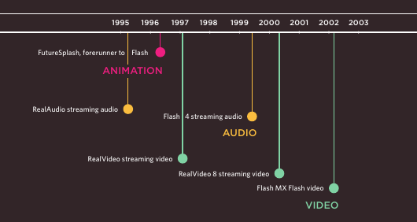

# 9. Flash, Video & Audio

## How Flash Works

- Since the late 1990s, Flash has been a very popular tool for creating animations, and later for playing audio and video in websites.

- Whether you are creating an animation or a media player in Flash, the files you put on your website are referred to as ***Flash movies***.
- When you create a Flash file in the Flash authoring environment, it is saved with the `.fla` file extension. In order to use this file on a web page it has to be saved in a different format known as ***SWF***. (It has the `.swf` file extension.)

- When you export the movie into SWF format, Flash creates code that you can use to embed the Flash movie in your page. Traditionally, this code used the HTML `<object>` and `<embed>` tags. However, now it is more common to use JavaScript.

- To view Flash, browsers need to use a plugin (an extra piece of software that runs in the browser) called the Flash Player. Statistics commonly indicate that 98% of browsers on desktop computers have the Flash plugin installed.
## Use of Flash

- Since 2005, a number of factors have meant that fewer websites are written in Flash or even use elements of Flash in their pages.

- When Flash was first released, it was developed to create animations. The technology quickly evolved, however, and people started to use it to build media players and even entire websites.
- Although Flash is still very popular, in recent years people have been more selective about when they use it (and now rarely consider building an entire website in Flash).
- Despite this, Flash does have a future on the web because there are some things it does very well, such as creating animations.
- There are several reasons why fewer websites are using Flash these days, including:
	- In 2005-6, a set of JavaScript libraries were launched (including Prototype, script.aculo.us, and JQuery) which made it easier for people to create animated effects using JavaScript.
	- When Apple launched the iPhone in 2007 and later the the iPad in 2010, they took the decision not to support Flash.
	- There have been laws introduced to ensure that websites are usable by those with visual or physical impairments - and Flash has been criticized because Flash content does not always meet accessibility requirements.
	- In 2008, browsers started to support HTML5 `<video>` and `<audio>` tags. At the time of writing, Flash is still a popular way of playing video and audio on the web but more and more people are switching to HTML5.
## Timeline: Flash, Video, Audio

- Web technologies change quickly. Here you can see some of the changes in how animation, video, and audio are created on the web.

- First major players to provide web animation, audio, and video.



- Some of the technologies and events replacing them.


## Adding A Flash Movie To Your Web Page

- The most popular way of adding Flash into a web page is using JavaScript. There are several scripts that allow you to do this without an in-depth understanding of the JavaScript language.
- The script we will be looking at here is called ***SWFObject***. You can obtain a copy of it for free from Google, and you can see how we use it on the next page.
- One advantage to using this technique is that it allows browsers to show alternative content for users whose browsers are not capable of showing Flash.
- This technique uses a `<div>` element to create a space where the Flash movie should sit. The `<div>` element has an id attribute whose value is used by the ***SWFObject*** script. In the example, the value of the id attribute is bird.
- Inside the `<div>` element you can place the alternative content for users who are not able to play Flash.

- The ***SWFObject*** script will check to see if the user's browser can play the Flash movie. If it can, the script will replace the content of the `<div>` with the `.swf` file.
- For users who cannot see the Flash movie, you could show a still from the movie instead. You might also like to consider using a text description of the Flash file.
- If you use a text description as alternative content, then you can achieve two further benefits:
	1. The text can be accessed by those with visual and/or physical impairments who are not able to interact with the Flash file.
	2. The text can be indexed by search engines (which are not as effective at indexing SWF files), increasing the chance that your content will be found.

- In this example, the SWFObject script is hosted on Google's servers. We include the script in this web page using the first of the two `<script>` elements.
- The type attribute is used on the `<script>` element to indicate that the script inside is written in JavaScript. The src attribute tells the browser where to find the script.
- The second `<script>` element is used to tell the browser about the Flash movie, as well as which element it should replace. This element is actually telling the SWFObject script five pieces of information, which are in the brackets:
	1. The location of the .swf file: `flash/bird.swf`
	2. The element that the Flash movie should replace, specified by the value of the id attribute on the `<div>` element: bird
	3. The width of the Flash movie: 400 px
	4. The height of the Flash movie: 300 px
	5. The minimum version of the Flash player needed to view the movie: Flash Player 8
---

```html
<!DOCTYPE html>
<html>
<head>
		 <title>Adding a Flash Movie</title>
		 <script type="text/javascript"
			 src="http://ajax.googleapis.com/ajax/libs/
			 swfobject/2.2/swfobject.js"></script>
		 <script type="text/javascript">
			 swfobject.embedSWF("flash/bird.swf",
			 "bird", "400", "300", "8.0.0");</script>
</head>
<body>
		 <div id="bird"><p>An animation of a bird taking
			 a shower</p></div>
</body>
</html>
```
---
## Understanding Video Formats and Players

- To add video to your site, there are two key issues to understand: file formats and video players/plugins.
### Formats

- Movies are available in many formats (BluRay, DVD, VHS, to name a few). 
- Online, there are even more video formats (including AVI, Flash Video, H264, MPEG, Ogg Theora, QuickTime, WebM, and Windows Media).
- Browsers differ in what video formats they do and don't support. In order for users to view your video online, you may need to convert it to another format.
- The process of converting a video into another format is sometimes referred to as "***encoding***" the video.
- There are several apps available on the web that enable you to encode videos (such as www.mirovideoconverter.com).
### Players / plugins

- Browsers were initially designed to show text and images only. For this reason, browsers built prior to 2010 generally required another program called a player or plugin to to be installed in order to play video content. These players and plugins only supported certain video formats.
- Recently browsers have evolved to support the HTML5 `<video>` tag (which renders players and plugins obsolete).
- Unfortunately, however, you cannot rely on every visitor to your website having a recent browser that supports this new HTML5 element and the browsers that do recognize the `<video>` element require the video to be encoded in different formats.
### Approach

- The easiest way to add video to your site is to use a hosted service such as YouTube or Vimeo.
- However, there are some cases where using these services is not appropriate and you will want to host the video on your own site.
- At the time of writing, to ensure most people can play your video content, it is considered best practice to use the HTML5 `<video>` element for browsers that support it, and also Flash video for those that do not.This means you would need to upload any videos you want to show in at least two different formats: WebM and MP4.
## Using Hosted Video Services

- The easiest way to add a video to your site is to upload the video to a site like YouTube or Vimeo and use the features provided on their site to embed the video in your page.
### Advantages

- Hosted video sites (such as YouTube) provide players that work with the majority of web browsers. You do not need to worry about encoding your video since these sites allow you to upload your content in a range of formats. Once uploaded, they automatically convert your video into the various formats required by different browsers.
- Web hosting companies often charge extra if you use a lot of bandwidth, and video files can be quite large. Therefore, it can cost you extra to host the videos on your own site. If your video is hosted on a site like YouTube or Vimeo, however, you do not need to pay for the bandwidth.
### Disadvantages

- Your video will be available on the site of the hosted service, so if you want the content to be exclusively available on your site (and not visible on other sites), you need to host the video on your own server and add your own player into the page.
- Some services will limit what your video is allowed to include. For example, most prohibit the use of advertising within the video you upload (which prevents you from monetizing that content).
- Some hosted services will play their own adverts before your video will begin, or even overlay them over the screen as your video is playing. The quality of video on some hosted services can also be limited.
### The Alternative

- If you want to host video on your own site - rather than a hosted service - a lot more work is involved in setting up your site to play the video.
- We will be looking at two different ways that you can host your own videos: using both Flash Video and the HTML5 `<video>` element.
- In order to ensure that the maximum number of visitors to your site can see the video, you will need to use a combination of both of these techniques.
## Preparing a Flash Video For Your Site

- There are three steps you need to follow to add a Flash Video to your web page:
### 1. Convert Your Video into FLV Format

- To play a Flash Video, you need to convert your video into FLV format. Since Flash 6, the Flash authoring environment has come with a Flash Video Encoder to convert videos into FLV format.
- Some Flash video players also support  ***H264*** format (and some video editing programs export video in this format).
### 2. Find an FLV Player to Play the Video

- You'll need a player written in Flash to play the FLV file. Its purpose is to hold the FLV movie and add controls such as play/pause. Here are two sites that offer FLV players:
	- www.osflv.com
	- www.longtailvideo.com
- You do not need the Flash authoring environment to use either of these on your website.
### 3. Include the Player & Video in Your Page

- You can include the player in your page using a JavaScript technique such as SWFObject.
- You will also need to tell the player where it can find the video file that you want it to play. (Some players have advanced features such as the ability to create playlists of multiple videos, or add a still picture before the video plays.)
## Adding A Flash Video To Your Pages

- This example uses the OS FLV player to display a video called `puppy.flv`, which has already been convered into FLV format.
- Sometimes Flash movies need information in order for them to work.
- In the example, the video player needs to know the path to the video it has to play, so SWFObject uses JavaScript variables to pass this information to the Flash movie. These are provided in the two lines of code that start with var.
- This particular player is not expecting any information in the flashvars variable, so that is left empty.
- The path to the movie is supplied in the variable called `params`.
```css
var params = {movie:
"../videos/puppy.flv"};
```

- The line after the variables is the one that tells the script to replace the HTML element with the video player. It is very similar to the one you saw in the earlier example that introduced SWFObject.
- Different video players usually require information such as the path to the video in slightly different formats, but they usually come with examples and documentation to help you understand how to use them.
```html
<!DOCTYPE html>
<html>
<head>
	<title>Adding a Flash Video</title>
	<script type="text/javascript" src="http://ajax.googleapis.com/ajax/libs/
			 swfobject/2.2/swfobject.js"></script>
	<script type="text/javascript">
		var flashvars = {};
		var params = {movie:"video/puppy.flv"};
		swfobject.embedSWF("flash/splayer.swf", "snow", "400", "320", "8.0.0", flashvars, params);</script>
</head>
<body>
	<div id="snow"><p>A video of a puppy playing in the snow</p></div>
</body>
</html>
```
## HTML5: Preparing Video For Your Pages

- Despite the HTML5 `<video>` element being a very recent addition, it is enjoying widespread use. Here are some of the key issues to be aware of:
### Support

- The new HTML5 `<video>` element is only supported by recent browsers, so you cannot just use this one technique if you want everyone to be able to see your video (you need to combine this HTML5 with Flash Video).
### Digital Rights

- At the time of writing, the `<video>` element does not support any type of Digital Rights Management (DRM - sometimes referred to as copy protection). But a dedicated pirate will usually find a way around DRM.
### Formats

- Not all browsers support the same video formats. Therefore, you need to supply your video in more than one format.
- To reach as many browsers as possible, you should provide the video in the following formats:
	- `H264`: IE and Safari
	- `WebM`: Android, Chrome, Firefox, Opera

- Chrome, Firefox, and Opera have indicated that they will support a format called ***WebM***.
### Controls

- The browser supplies its own controls for the player, and these can vary from browser to browser. You can control the appearance of these controls using JavaScript.
### In the Browser

- One of the problems with players such as the Flash Player is that they can behave inconsistently when elements such as menus drop over them, or the window is scaled up or down. The HTML5 option solves these issues.
## HTML5: Adding Video To Your Pages

`<video>`

- The `<video>` element has a number of attributes which allow you to control video playback:

`src`
- This attribute specifies the path to the video. (The example video is in H264 format so it will only work in IE and Safari.)

`poster`
- This attribute allows you to specify an image to show while the video is downloading or until the user tells the video to play.

`width, height`
- These attributes specify the size of the player in pixels.

`controls`
- When used, this attribute indicates that the browser should supply its own controls for playback.

`autoplay`
- When used, this attribute specifies that the file should play automatically.

`loop`
- When used, this attribute indicates that the video should start playing again once it has ended.

`preload`
- This attribute tells the browser what to do when the page loads. It can have one of three values:

`none`
- The browser should not load the video until the user presses play.

`auto`
- The browser should download the video when the page loads.

`metadata`
- The browser should just collect information such as the size, first frame, track list, and duration.

- In HTML5 you do not need to supply values for all attributes, such as the controls, autoplay, and loop attributes used with the `<video>` element. These attributes are like on/off switches. If the attribute is present, it turns that option on. If the attribute is omitted, the option is turned off.
- If the browser does not support the `<video>` element or the format of video used, it will display whatever is between the opening `<video>` and closing `</video>` tags.
---
- Example:

```html
<!DOCTYPE html>
<html>
<head>
		 <title>Adding HTML5 Video</title>
</head>
<body>
		 <video src="video/puppy.mp4"
			 poster="images/puppy.jpg"
			 width="400" height="300"
			 preload
			 controls
			 loop>
			 <p>A video of a puppy playing in the snow</p>
		 </video>
</body>
</html>
```

- Result:

<html>
<head>
		 <title>Adding HTML5 Video</title>
</head>
<body>
		 <video src="video/puppy.mp4"
			 poster="images/puppy.jpg"
			 width="400" height="300"
			 preload
			 controls
			 loop>
			 <p>A video of a puppy playing in the snow</p>
		 </video>
</body>
</html>

---
## HTML5: Multiple Video Sources

`<source>`
- To specify the location of the file to be played, you can use the `<source>` element inside the `<video>` element. (This should replace the `src` attribute on the opening `<video>` tag.)
- You can also use multiple `<source>` elements to specify that the video is available in different formats.
- (Due to a bug on the iPad, you should provide the MP4 video as the first format. Otherwise, it might not play.)

`src`
- This attribute specifies the path to the video.

`type`
- You should use this attribute to tell the browser what format the video is. Otherwise, it will download some of the video to see if it can play the file (which will take time and bandwidth).

`codecs`
- The codec that was used to encode the video is supplied within the type attribute. Note the use of single quotes, as well as double quotes in the type attribute, when it is supplied.

- If the browser does not support the `<video>` element or the format of video used, it will display whatever is between the opening `<video>` and closing `</video>` tags.

---
- Example:
```html
<!DOCTYPE html>
<html>
<head>
		 <title>Multiple Video Sources</title>
</head>
<body>
		 <video poster="images/puppy.jpg" width="400"
			 height="320" preload controls loop>
			 <source src="video/puppy.mp4" type='video/
				 mp4;codecs="avc1.42E01E, mp4a.40.2"' />
			 <source src="video/puppy.webm" type='video/
				 webm;codecs="vp8, vorbis"' />
			 <p>A video of a puppy playing in the snow</p>
		 </video>
</body>
</html>
```
- Results:
<html>
<head>
		 <title>Multiple Video Sources</title>
</head>
<body>
		 <video poster="images/puppy.jpg" width="400"
			 height="320" preload controls loop>
			 <source src="video/puppy.mp4" type='video/
				 mp4;codecs="avc1.42E01E, mp4a.40.2"' />
			 <source src="video/puppy.webm" type='video/
				 webm;codecs="vp8, vorbis"' />
			 <p>A video of a puppy playing in the snow</p>
		 </video>
</body>
</html>

---
## HTML5: Combining Flash & HTML5 Video

- By offering your videos in both HTML5 and Flash Video formats, you will ensure that it can be viewed by the majority of users on your site.
- You may choose to offer HTML5 as the first option, and Flash video as a fallback for people whose browser does not support HTML5 video. Or you may work the other way around.
- Because some of the video players built in Flash support H264 encoding, if you use a player that supports this format you would only need to provide the video in H264 and WebM formats. (You would not need it in FLV format as well.)

- If you start to work with HTML5 video in depth, you can also:
	- Create your own playback controls
	- Provide different versions of the video for browsers that have different sized screens (so you can provide lower resolution content for handheld devices)
	- Tell different parts of a page to change when the video reaches a certain point.
## Adding Audio to Web Pages

- By far the most popular format for putting audio on web pages is MP3. As with video, there are three routes commonly taken:
1. Use a Hosted Service
	- There are several sites that allow you to upload your audio, and provide a player which you can embed in your page, such as SoundCloud.com.
2. Use Flash
	- There are several Flash movies that allow you to play MP3 files; from simple buttons that play one track to complex players that allow you to create playlists and juke boxes.
3. Use HTML5
	- HTML5 has introduced a new `<audio>` element. Browsers that support this element provide their own controls - much as they do for the video files we just looked at.

- Some people ask how to get music to play consistently even when visitors move from one page to another on a website.
- This is actually quite difficult to achieve and would rely on techniques like using AJAX to load page content or developing the entire site in Flash.
- This is why some sites offer audio players in new windows, so that listeners are not interrupted when they move between pages.
## Adding A Flash MP3 Player

- There are many MP3 players that have already been written in Flash, such as:
	flash-mp3-player.net
	musicplayer.sourceforge.net
	www.wimpyplayer.com
- Each of these players has different functionality, so check their features before choosing one for your site.
---
- Example:
```html
<html>
<head>
		 <title>Adding a Flash MP3 Player</title>
		 <script type="text/javascript"
			 src="http://ajax.googleapis.com/ajax/libs/
			 swfobject/2.2/swfobject.js"></script>
			 
		 <script type="text/javascript">
			 var flashvars = {};
			 var params = {mp3: "audio/test-audio.mp3"};
			 swfobject.embedSWF(
				 "flash/player_mp3_1.0.0.swf",
				 "music-player", "200", "20", "8.0.0",
				 flashvars, params);</script>
</head>
<body>
		 <div id="music-player">
			 <p>You cannot hear this track because this
				 browser does not support our Flash music
				 player.</p>
		 </div>
</body>
</html>
```
- Result:
<html>
<head>
		 <title>Adding a Flash MP3 Player</title>
		 <script type="text/javascript"
			 src="http://ajax.googleapis.com/ajax/libs/
			 swfobject/2.2/swfobject.js"></script>
		 <script type="text/javascript">
			 var flashvars = {};
			 var params = {mp3: "audio/test-audio.mp3"};
			 swfobject.embedSWF(
				 "flash/player_mp3_1.0.0.swf",
				 "music-player", "200", "20", "8.0.0",
				 flashvars, params);</script>
</head>
<body>
		 <div id="music-player">
			 <p>You cannot hear this track because this
				 browser does not support our Flash music
				 player.</p>
		 </div>
</body>
</html>
---

- This example uses a free player from flash-mp3-player.net which is embedded in the page using the SWFObject technique. The player is told the path to the MP3 file using a parameter called mp3.
- After the second `<script>` tag, you can see that we have created two JavaScript variables; the first called `flashvars`, the second called `params`. Even though we are not using the flashvars variable, the SWFObject script expects it before the params variable so we need it there.
```js
var flashvars = {};
var params = {
mp3: "music/noise.mp3"};
```

- These variables are then added at the end of the line that embeds the MP3 player in the page (just before the second closing `<script>` tag).
## HTML5: Adding HTML5 Audio To Your Pages

`<audio>`
- HTML5 introduced the `<audio>` element to include audio files in your pages. As with HTML5 video, browsers expect different formats for the audio.
- The `<audio>` element has a number of attributes which allow you to control audio playback:

`src`
- This attribute specifies the path to the audio file.

`controls`
- This attribute indicates whether the player should display controls. If you do not use this attribute, no controls will be shown by default. You can also specify your own controls using JavaScript.

`autoplay`
- The presence of this attribute indicates that the audio should start playing automatically. (It is considered better practice to let visitors choose to play audio.)

`preload`
- This attribute indicates what the browser should do if the player is not set to autoplay. It can have the same values we saw for the `<video>` element.

`loop`
- This attribute specifies that the audio track should play again once it has finished.

---
- Example:
```html
<!DOCTYPE html>
<html>
<head>
		 <title>Adding HTML5 Audio</title>
</head>
<body>
		 <audio src="audio/test-audio.ogg"
			 controls autoplay>
			 <p>This browser does not support our audio
			 format.</p>
		 </audio>
</body>
</html>
```
- Result:
<html>
<head>
		 <title>Adding HTML5 Audio</title>
</head>
<body>
		 <audio src="audio/test-audio.ogg"
			 controls autoplay>
			 <p>This browser does not support our audio
			 format.</p>
		 </audio>
</body>
</html>

- This example only works in browsers that support the Ogg Vorbis audio format (Firefox, Chrome, and Opera). For it to work in Safari 5 and IE 9, the audio would need to be in MP3 format (or use the `<source>` element covered on the next page to offer different formats).
---
## HTML5: Multiple Audio Sources

`<source>`
- It is possible to specify more than one audio file using the `<source>` element between the opening `<audio>` and closing `</audio>` tags (instead of the `src` attribute on the opening `<audio>` tag).
- This is important because different browsers support different formats for audio files.
- `MP3`: Safari 5+, Chrome 6+, IE9
- `Ogg Vorbis`: Firefox 3.6, Chome 6, Opera 1.5, IE9

- So you would need to supply two audio formats to get coverage across all recent browsers that support the `<audio>` element. You could also provide a Flash alternative for older browsers that do not support the `<audio>` element.

- The HTML5 `<audio>` tag has not gained as widespread adoption as the `<video>` tag, and there have been some issues with audio quality in the first browsers to implement it.
`src`
- The <source> element uses the `src` attribute to indicate where the audio file is located.

`type`
- At the time of writing, the `type` attribute was not commonly being used on the `<source>` element in the same way it was for the `<video>` element.

---
- Example:
```html
<!DOCTYPE html>
<html>
<head>
		 <title>Multiple Audio Sources</title>
</head>
<body>
		 <audio controls autoplay>
			 <source src="audio/test-audio.ogg" />
			 <source src="audio/test-audio.mp3" />
			 <p>This browser does not support our audio
			 format.</p>
		 </audio>
</body>
</html>
```
- Result:
<html>
<head>
		 <title>Multiple Audio Sources</title>
</head>
<body>
		 <audio controls autoplay>
			 <source src="audio/test-audio.ogg" />
			 <source src="audio/test-audio.mp3" />
			 <p>This browser does not support our audio
			 format.</p>
		 </audio>
</body>
</html>
---