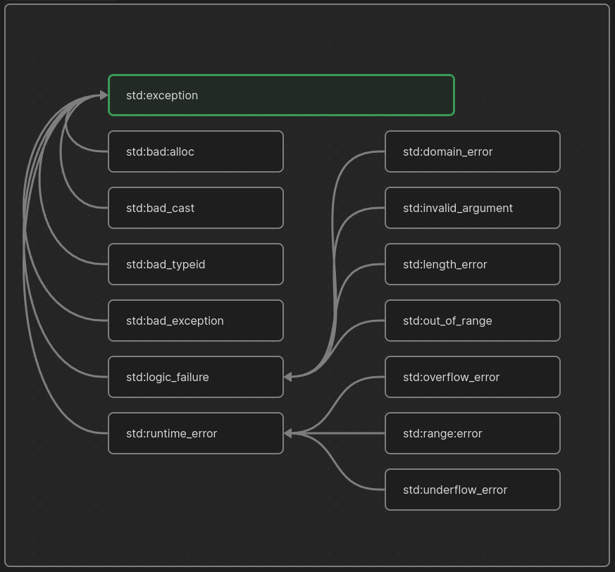

# 31. Exception Handling

- An exception is a problem that arises during the execution of a program. A C++ exception is a response to an exceptional circumstance that arises while a program is running.

- Exceptions provide a way to transfer control from one part of a program to another. C++ exception handling is built upon three keywords: `try`, `catch`, and `throw`.
	- `throw`: A program throws an exception when a problem shows up. This is done using a `throw` keyword.
	- `catch`: A program catches an exception with an exception handler at the place in a program where you want to handle the problem. The `catch` keyword indicates the catching of an exception.
	- `try`: A `try` block identifies a block of code for which particular exceptions will be activated. It is followed by one or more catch blocks.

- Assuming a block will raise an exception, a method catches an exception using a combination of the `try` and `catch` keywords. A try/catch block is placed around the code that might generate an exception. Code within a try/catch block is referred to as protected code, and the syntax for using try/catch is as follows:
```cpp
try{
	// protected code
}catch( ExceptionName e1 ){
	// catch block
}catch( ExceptionName e2 ){
	// catch block
}catch( ExceptionName eN ){
	// catch block
}
```

- You can list down multiple catch statements to `catch` different type of exceptions in case your `try` block raises more than one exception in different situations.
## Throwing Exceptions

- Exceptions can be thrown anywhere within a code block using `throw` statement. The operand of the throw statement determines a type for the exception and can be any expression and the type of the result of the expression determines the type of exception thrown.
## Catching Exceptions

- The `catch` block following the try block catches any exception. You can specify what type of exception you want to catch and this is determined by the exception declaration that appears in parentheses following the keyword `catch`.
- If you want to specify that a `catch` block should handle any type of exception that is thrown in a try block, you must put an ellipsis, ..., between the parentheses enclosing the exception declaration as follows:
```cpp
try{
	// protected code
}catch(...){
	// code to handle any exception
}
```
# C++ Standard Exceptions

- C++ provides a list of standard exceptions defined in `<exception>` which we can use in our programs. These are arranged in a parent-child class hierarchy shown below:


- Here is the small description of each exception mentioned in the above hierarchy:

| Exception               | Description                                                                                           |
| ----------------------- | ----------------------------------------------------------------------------------------------------- |
| `std::exception`        | An exception and parent class of all the standard C++<br>exceptions.                                  |
| `std::bad_alloc`        | This can be thrown by `new`.                                                                          |
| `std::bad_cast`         | This can be thrown by `dynamic_cast`.                                                                 |
| `std::bad_exception`    | This is useful device to handle unexpected exceptions in a C++ program.                               |
| `std::bad_typeid`       | This can be thrown by ``typeid``.                                                                     |
| `std::logic_error`      | An exception that theoretically can be detected by reading the code.                                  |
| `std::domain_error`     | This is an exception thrown when a mathematically invalid domain is used.                             |
| `std::invalid_argument` | This is thrown due to invalid arguments.                                                              |
| `std::length_error`     | This is thrown when a too big `std::string` is created.                                               |
| `std::out_of_range`     | This can be thrown by the ‘at’ method, for example a `std::vector` and `std::bitset<>::operator[]()`. |
| `std::runtime_error`    | An exception that theoretically cannot be detected by reading the code.                               |
| `std::overflow_error`   | This is thrown if a mathematical overflow occurs.                                                     |
| `std::range_error`      | This is occurred when you try to store a value which is out of range.                                 |
| `std::underflow_error`  | This is thrown if a mathematical underflow occurs.                                                    |
## Define New Exceptions

- You can define your own exceptions by inheriting and overriding exception class functionality.