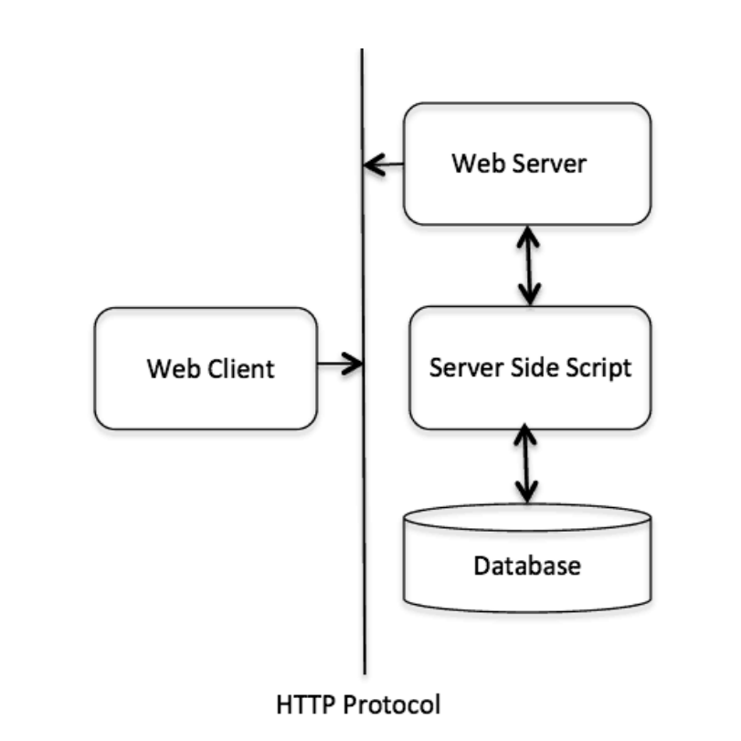

# 38. Web Programming

## What is CGI?

- ***The Common Gateway Interface***, or CGI, is a set of standards that define how information is exchanged between the web server and a custom script.
- The CGI specs are currently maintained by the NCSA and NCSA defines CGI is as follows:
	- The Common Gateway Interface, or CGI, is a standard for external gateway programs to interface with information servers such as HTTP servers.
	- The current version is CGI/1.1 and CGI/1.2 is under progress.
## Web Browsing

- To understand the concept of CGI, let's see what happens when we click a hyperlink to browse a particular web page or URL.
	- Your browser contacts the HTTP web server and demand for the URL i.e. filename.
	- Web Server will parse the URL and will look for the filename. If it finds the requested file then web server sends that file back to the browser otherwise sends an error message indicating that you have requested a wrong file.
	- Web browser takes response from web server and displays either the received file or error message based on the received response.

- However, it is possible to set up the HTTP server in such a way that whenever a file in a certain directory is requested, that file is not sent back; instead it is executed as a program, and produced output from the program is sent back to your browser to display.
- The Common Gateway Interface (CGI) is a standard protocol for enabling applications (called CGI programs or CGI scripts) to interact with Web servers and with clients. These CGI programs can be a written in Python, PERL, Shell, C or C++ etc.
## CGI Architecture Diagram

- The following simple program shows a simple architecture of CGI:


## Web Server Configuration

- Before you proceed with CGI Programming, make sure that your Web Server supports CGI and it is configured to handle CGI Programs. All the CGI Programs to be executed by the HTTP server are kept in a pre-configured directory. This directory is called CGI directory and by convention it is named as `/var/www/cgi-bin`. By convention CGI files will have extension as .cgi, though they are C++ executable.
- By default, Apache Web Server is configured to run CGI programs in `/var/www/cgi-bin`. If you want to specify any other directory to run your CGI scripts, you can modify the following section in the `httpd.conf` file:

```
<Directory "/var/www/cgi-bin">
AllowOverride None
Options ExecCGI
Order allow,deny
Allow from all
</Directory>
<Directory "/var/www/cgi-bin">
Options All
</Directory>

```

- Here, I assume that you have Web Server up and running successfully and you are able to run any other CGI program like Perl or Shell etc.
## First CGI Program

- Consider the following C++ Program content:

```cpp
#include <iostream>
using namespace std;

int main (){
	cout << "Content-type:text/html\r\n\r\n";
	cout << "<html>\n";
	cout << "<head>\n";
	cout << "<title>Hello World - First CGI Program</title>\n";
	cout << "</head>\n";
	cout << "<body>\n";
	cout << "<h2>Hello World! This is my first CGI program</h2>\n";
	cout << "</body>\n";
	cout << "</html>\n";
	return 0;
}

```

- Compile above code and name the executable as `cplusplus.cgi`. This file is being kept in `/var/www/cgi-bin` directory and it has following content. Before running your CGI program make sure you have change mode of file using `chmod 755 cplusplus.cgi` UNIX command to make file executable. Now if you click `cplusplus.cgi` then this produces the following output:
### My First CGI program

- The above C++ program is a simple program which is writing its output on STDOUT file i.e. screen. There is one important and extra feature available which is first line printing `Content-type:text/html\r\n\r\n`. This line is sent back to the browser and specify the content type to be displayed on the browser screen.
- Now you must have understood the basic concept of CGI and you can write many complicated CGI programs using Python. A C++ CGI program can interact with any other external system, such as RDBMS, to exchange information.
## HTTP Header

- The line `Content-type:text/html\r\n\r\n` is a part of HTTP header, which is sent to the browser to understand the content. All the HTTP header will be in the following form:
```http
HTTP Field Name: Field Content
For Example
Content-type: text/html\r\n\r\n
```

- There are few other important HTTP headers, which you will use frequently in your CGI Programming.

| Header              | Description                                                                                                                                                                                     |
| ------------------- | ----------------------------------------------------------------------------------------------------------------------------------------------------------------------------------------------- |
| Content-type:       | A MIME string defining the format of the file being returned. Example is Content-type:text/html.                                                                                                |
| Expires: Date       | The date the information becomes invalid. This should be used by the browser to decide when a page needs to be refreshed. A valid date string should be in the format 01 Jan 1998 12:00:00 GMT. |
| Location: URL       | The URL that should be returned instead of the URL requested. You can use this field to redirect a request to any file.                                                                         |
| Last-modified: Date | The date of last modification of the resource                                                                                                                                                   |
| Content-length: N   | The length, in bytes, of the data being returned. The browser uses this value to report the estimated download time for a file.                                                                 |
| Set-Cookie: Strin   | Set the cookie passed through the string.                                                                                                                                                       |
## CGI Environment Variables

- All the CGI program will have access to the following environment variables. These variables play an important role while writing any CGI program.

| Variable Name   | Description                                                                                                                                   |
| --------------- | --------------------------------------------------------------------------------------------------------------------------------------------- |
| CONTENT_TYPE    | The data type of the content, used when the client is sending attached content to the server. For example file upload etc.                    |
| CONTENT_LENGTH  | The length of the query information that is available only for POST requests.                                                                 |
| HTTP_COOKIE     | Returns the set cookies in the form of key & value pair.                                                                                      |
| HTTP_USER_AGENT | The User-Agent request-header field contains information about the user agent originating the request. It is a name of the web browser.       |
| PATH_INFO       | The path for the CGI script.                                                                                                                  |
| QUERY_STRING    | The URL-encoded information that is sent with GET method request.                                                                             |
| REMOTE_ADDR     | The IP address of the remote host making the request. This can be useful for logging or for authentication purpose.                           |
| REMOTE_HOST     | The fully qualified name of the host making the request. If this information is not available then REMOTE_ADDR can be used to get IR address. |
| REQUEST_METHOD  | The method used to make the request. The most common methods are GET and POST.                                                                |
| SCRIPT_FILENAME | The full path to the CGI script                                                                                                               |
| SERVER_NAME     | The name of the CGI script.                                                                                                                   |
| SERVER_NAME     | The server's hostname or IP Address.                                                                                                          |
| SERVER_SOFTWARE |  The name and version of the software the server is running                                                                                   |
- Here is small CGI program to list out all the CGI variables.
```cpp
#include <iostream>
#include <stdlib.h>

using namespace std;

const string ENV[ 24 ] = {
    "COMSPEC", "DOCUMENT_ROOT", "GATEWAY_INTERFACE",
    "HTTP_ACCEPT", "HTTP_ACCEPT_ENCODING",
    "HTTP_ACCEPT_LANGUAGE", "HTTP_CONNECTION",
    "HTTP_HOST", "HTTP_USER_AGENT", "PATH",
    "QUERY_STRING", "REMOTE_ADDR", "REMOTE_PORT",
    "REQUEST_METHOD", "REQUEST_URI", "SCRIPT_FILENAME",
    "SCRIPT_NAME", "SERVER_ADDR", "SERVER_ADMIN",
    "SERVER_NAME","SERVER_PORT","SERVER_PROTOCOL",
    "SERVER_SIGNATURE","SERVER_SOFTWARE"

};

int main (){
    cout << "Content-type:text/html\r\n\r\n";
    cout << "<html>\n";
    cout << "<head>\n";
    cout << "<title>CGI Environment Variables</title>\n";
    cout << "</head>\n";
    cout << "<body>\n";
    cout << "<table border = \"0\" cellspacing = \"2\">";

    for ( int i = 0; i < 24; i++ ){
        cout << "<tr><td>" << ENV[ i ] << "</td><td>";
        // attempt to retrieve value of environment variable
        char *value = getenv( ENV[ i ].c_str() );

        if ( value != 0 ){
            cout << value;
        }else{
            cout << "Environment variable does not exist.";
        }
        cout << "</td></tr>\n";
    }
    cout << "</table><\n";
    cout << "</body>\n";
    cout << "</html>\n";

    return 0;
}
```

- The output is as follows:
``` http
COMSPEC               Environment variable does not exist.
DOCUMENT_ROOT         /var/www/tutorialspoint
GATEWAY_INTERFACE     CGI/1.1
HTTP_ACCEPT           text/html, application/xhtml+xml, */*
HTTP_ACCEPT_ENCODING  gzip, deflate
HTTP_ACCEPT_LANGUAGE  en-US
HTTP_CONNECTION       Keep-Alive
HTTP_HOST             www.tutorialspoint.com
HTTP_USER_AGENT       Mozilla/5.0 (Windows NT 6.3; WOW64; Trident/7.0;                          rv:11.0) like Gecko
PATH                  /sbin:/usr/sbin:/bin:/usr/bin
QUERY_STRING
REMOTE_ADDR           183.82.104.71
REMOTE_PORT           50902
REQUEST_METHOD        GET
REQUEST_URI           /cgi-bin/cpp_env.cgi
SCRIPT_FILENAME       /var/www/cgi-bin/cpp_env.cgi
SCRIPT_NAME           /cgi-bin/cpp_env.cgi
SERVER_ADDR           66.135.33.172
 SERVER_ADMIN         webmaster@tutorialspoint.com
SERVER_NAME           www.tutorialspoint.com
SERVER_PORT          80
SERVER_PROTOCOL      HTTP/1.1
SERVER_SIGNATURE 
SERVER_SOFTWARE      Apache
<
```
## C++ CGI Library

- For real examples, you would need to do many operations by your CGI program. There is a CGI library written for C++ program which you can download from ftp://ftp.gnu.org/gnu/cgicc/

- You can check related documentation available at 'C++ CGI Lib Documentation